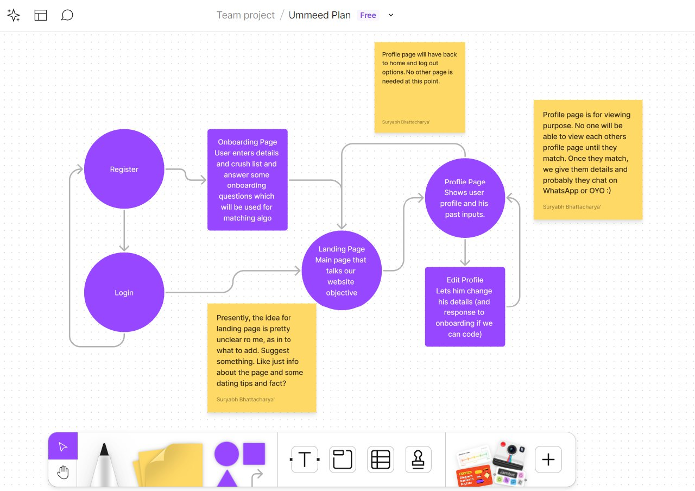

# apple-of-my-eye
Matchmaking at NITT
# Problem Statement
In NITT, there are many singles, and it's common for people to have crushes on one another. There's a possibility that someone you like may also have feelings for you. Our main aim is to facilitate matches between individuals in the NITT.

If direct matches aren't found, we explore pairing individuals based on their personalities. We suggest potential matches exclusively within the NITT.

# Objectives
**Facilitating Matches**: The primary objective is to facilitate connections and potential matches between individuals within the NITT who may have mutual romantic interests.

**Exploring Possibilities**: To explore the potential for romantic connections beyond direct matches by considering personality compatibility and other relevant factors.

**Enhancing Social Dynamics**: Encouraging a positive and supportive social environment within the NITT community by fostering relationships and connections among its members.

**Promoting Inclusivity**: Ensuring that the matchmaking process is inclusive and respectful of all individuals' preferences and identities within the NITT community.

**Providing a Platform**: Offering a platform or mechanism through which individuals can express their interests and preferences in a safe and respectful manner.

# Work Flow

